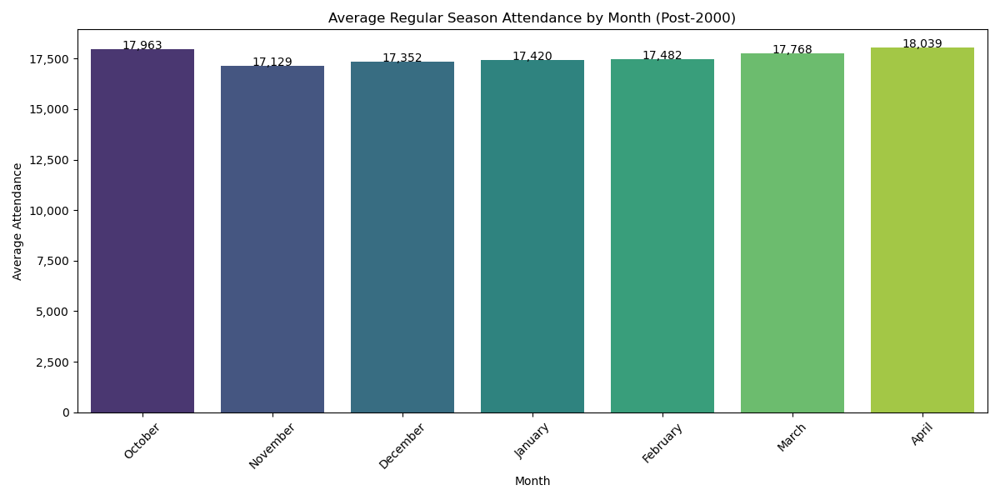
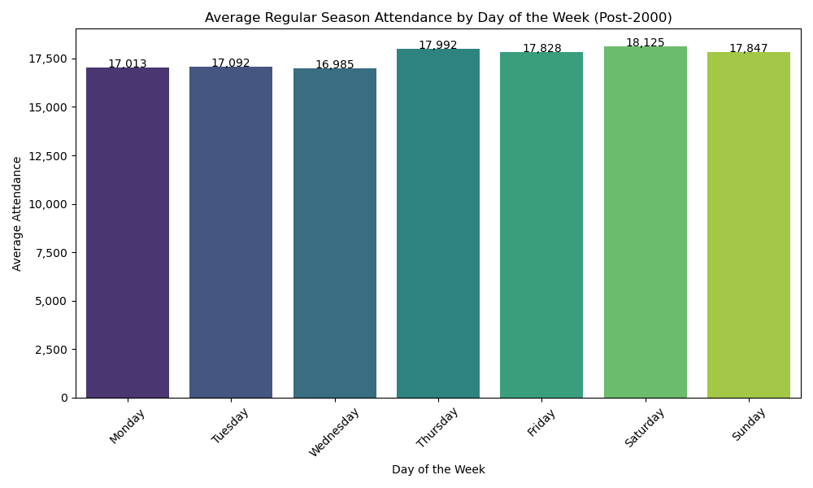
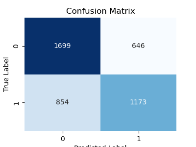

# NBA Attendance Analysis

## Table of Contents
- [Project Overview](#project-overview)
- [Dataset](#dataset)
- [Methodology](#methodology)
- [Key Findings](#key-findings)
- [Model Performance](#model-performance)
- [Recommendations](#recommendations)
- [Future Work](#future-work)
- [Installation and Usage Instructions](#installation-and-usage-instructions)
- [Visuals](#visuals)
- [Contact](#contact)

## Project Overview
This project aims to analyze the factors influencing NBA game attendance. By leveraging data from various sources and applying logistic regression, the project seeks to uncover patterns that drive attendance, such as team performance, scheduling, and other contextual factors. The model developed provides actionable insights to optimize NBA scheduling, marketing strategies, and resource allocation. [View Full Report](PDFs/NBA-AnalysisReport.pdf)

## Dataset
The dataset used for this analysis was sourced from Kaggle's [Basketball Database](https://www.kaggle.com/datasets/wyattowalsh/basketball), which includes:
- **Game Table**: Detailed information about each game.
- **Game Summary Table**: Summarized statistics for each game (e.g., points scored by home and away teams).
- **Player Table**: Data on participating players.
- **Team Table**: Geographic and historical details about NBA teams.

After downloading, the database should be placed in the `data` folder of this repository.

## Methodology
### Data Preparation
1. **Data Cleaning**: Removed irrelevant features, handled missing values, and excluded irregular seasons.
2. **Feature Engineering**: Created new features like:
   - **Attendance Ratio**: Ratio of actual attendance to the arena's capacity.
   - **Distance Traveled by Away Team**: Based on team locations.
   - **Previous Season Playoff Participation**: Whether the team participated in the previous playoffs.
   
3. **Merging Data**: Combined relevant tables to build a comprehensive dataset for analysis.

### Model Development
- Developed a **logistic regression model** to predict whether a game will have above-average attendance.
- The model was optimized using grid search with 5-fold cross-validation to tune hyperparameters, such as the regularization strength (`C`) and penalty type.
  
### Model Evaluation
The model was evaluated using standard metrics such as accuracy, precision, recall, and a confusion matrix.

## Key Findings
1. **Attendance Peaks**: Attendance is highest in **April**, with an average of 18,039 attendees. Fridays and Sundays are the best days for fan turnout.
2. **Top Positive Predictors**:
   - **Away Team Win Percentage**: Games against high-performing away teams draw larger crowds.
   - **Day of the Week**: Games on Fridays and Saturdays increase the likelihood of higher attendance.
   - **Previous Season Playoff Participation**: Slightly increases attendance.
   
3. **Top Negative Predictors**:
   - **Months**: November, December, and January show lower attendance.
   - **Distance Traveled by Away Team**: The farther the away team travels, the lower the attendance.
   - **Midweek Games**: Monday, Tuesday, and Wednesday games have lower attendance.

## Model Performance
- **Accuracy**: The logistic regression model achieved an accuracy of approximately **66%**.
- **Confusion Matrix**:
    - True Positives: 1,173
    - True Negatives: 1,699
    - False Positives: 646
    - False Negatives: 854

The model is better at predicting below-average attendance but performs reasonably well overall. Precision and recall scores are around **0.65** for both classes.

## Recommendations
1. **Strategic Scheduling**: Prioritize scheduling key games on **Fridays, Sundays, and Saturdays**, particularly in **March** and **April** when fan interest is highest.
2. **Target High-Impact Games**: Focus on games involving high-performing away teams to maximize attendance.
3. **Marketing Focus**: Concentrate marketing efforts during March and April to capitalize on peak fan interest.
4. **Operational Planning**: Allocate additional resources for high-traffic games predicted to have higher attendance.

## Future Work
Future exploration could focus on:
- Predicting sellout games.
- Incorporating external factors such as weather, player appearances, or local events to refine predictions further.

## Installation and Usage Instructions
1. **Clone the repository**:
   ```bash
   git clone https://github.com/drojas-25/nba-attendance-analysis.git
   cd nba-attendance-analysis
   ```

2. **Setting Up the Environmentt**:
This project uses several Python packages for data analysis and visualization. Below is a list of the main dependencies. You can install them using the package manager of your choice (e.g., `conda`, `pip`).

3. **Required Packages**:
The following packages are necessary to run the project:

- `python=3.12`
- `ipykernel`
- `matplotlib`
- `seaborn`
- `numpy`
- `pandas`
- `geopy`
- `scikit-learn`

4. **Download the dataset**:
   Download the SQLite database from [Kaggle](https://www.kaggle.com/datasets/wyattowalsh/basketball) and place it in the `data` folder.

5. **Run the notebooks**:
   The project consists of three Jupyter notebooks (see descriptions below). Run them in order to replicate the analysis. Each notebook outputs additional CSV files and visuals, which will be saved in their respective folders.
   - **01-EDA.ipynb**: Focuses on conducting exploratory data analysis (EDA) for NBA-related datasets stored in an SQLite database. The notebook starts by setting up the environment with necessary packages and establishing a connection to the database. It explores multiple tables, such as the Game, Game Summary, and Player tables, examining their structures, data types, and statistics. Key steps include data cleaning, transformation (e.g., creating features like game duration and location information), and merging different datasets to prepare for further analysis. The results are exported for future use in modeling or further exploration.
   - **02-DataAnalysis.ipynb**: Focuses on analyzing NBA regular season game attendance with a detailed time series and comparative analysis. It aims to explore how attendance changes over time, both across multiple seasons and within a single season, and examines the variation based on the day of the week. The notebook visualizes key insights through charts, such as average attendance by month and day of the week, using data filtered from post-2000 games to reflect current trends. The analysis offers valuable insights into patterns of fan engagement over different periods and game schedules.

   - **03-Modeling.ipynb**: Focuses on building and evaluating a logistic regression model to predict NBA game attendance. Key steps include preprocessing the data by filtering specific seasons, one-hot encoding categorical variables, and addressing multicollinearity through dimensionality reduction. The model development phase involves implementing a logistic regression model with a pipeline for hyperparameter tuning, using grid search to optimize performance. The notebook also splits the dataset into training and testing sets and evaluates the model’s accuracy, identifying top predictors of game attendance based on the results.


## Visuals
Some key visuals from the analysis:

1. **Attendance by Month**:
   
   
2. **Attendance by Day of the Week**:
   
   
3. **Confusion Matrix**:
   
   
   
These visuals highlight trends in attendance and the model's performance.
You can find a more detailed analysis in my report [here](PDFs/NBA-AnalysisReport.pdf)

## Contact
**Daniel Rojas**  
If you have any questions or want to discuss the project, feel free to reach out on [LinkedIn](https://www.linkedin.com/in/danielrojas25/).
